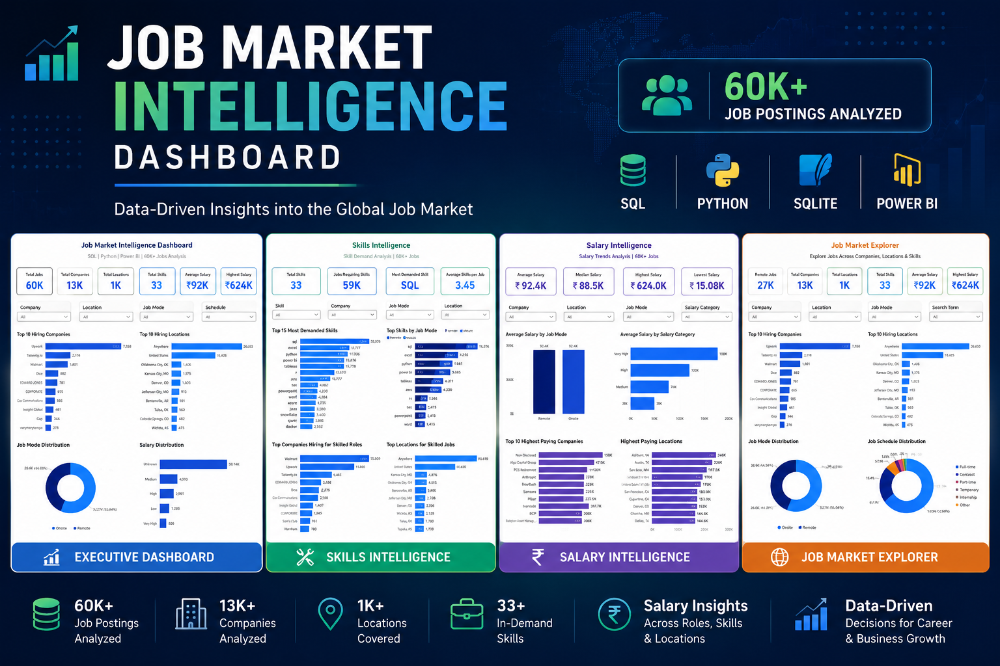
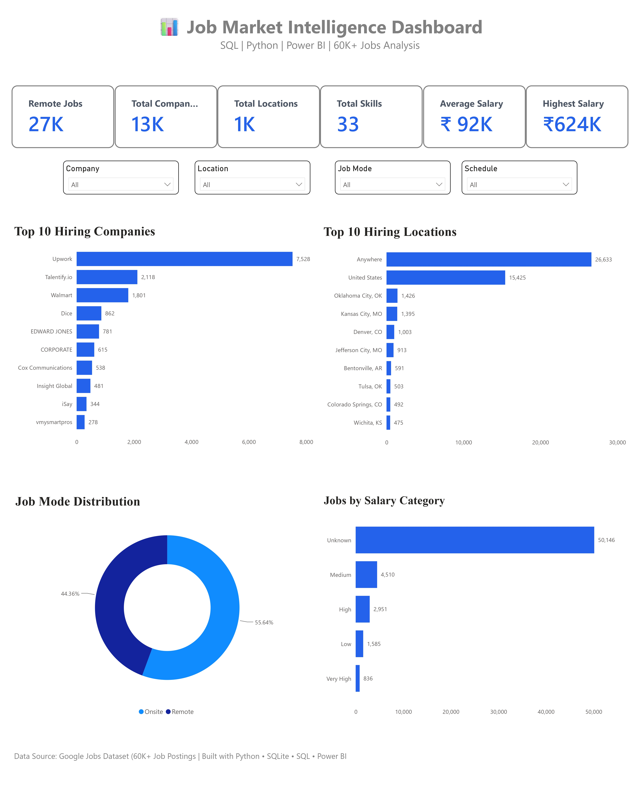
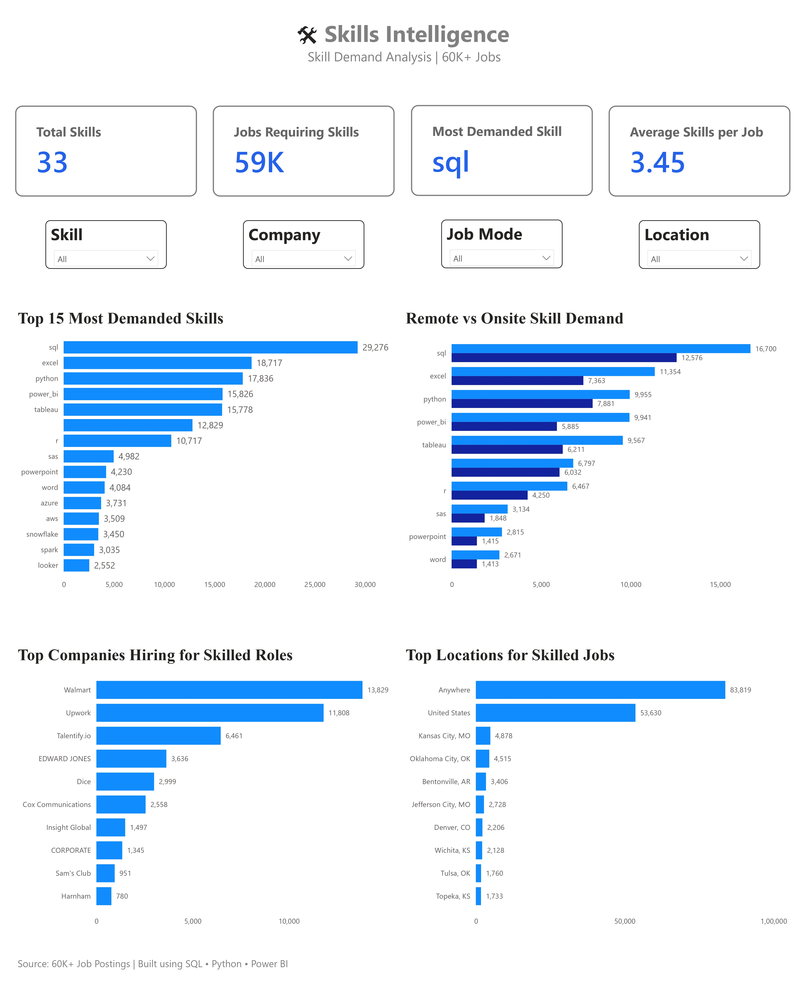
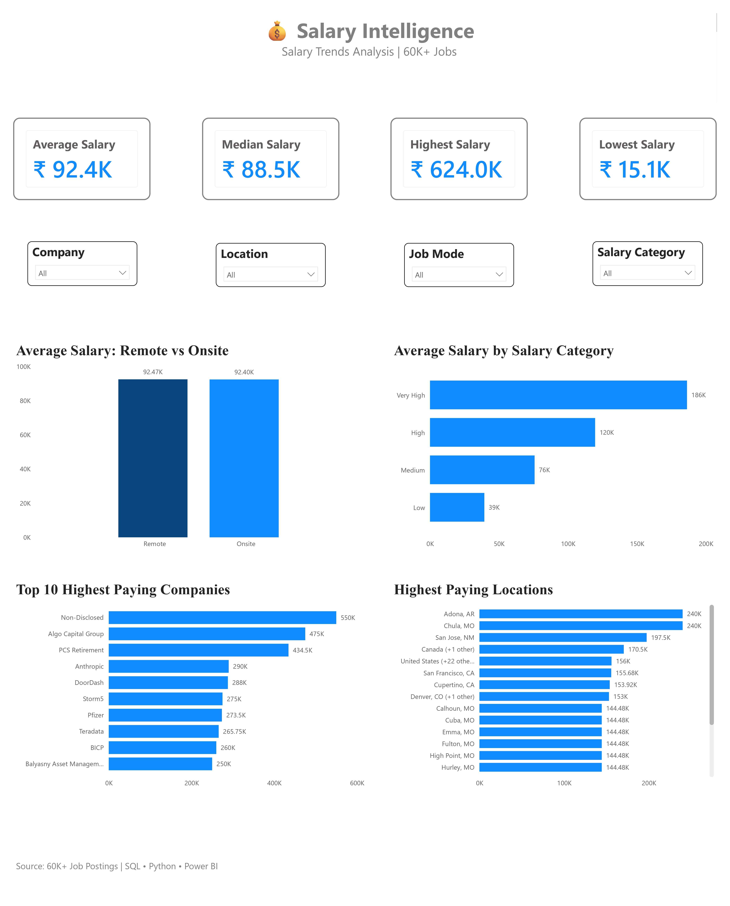
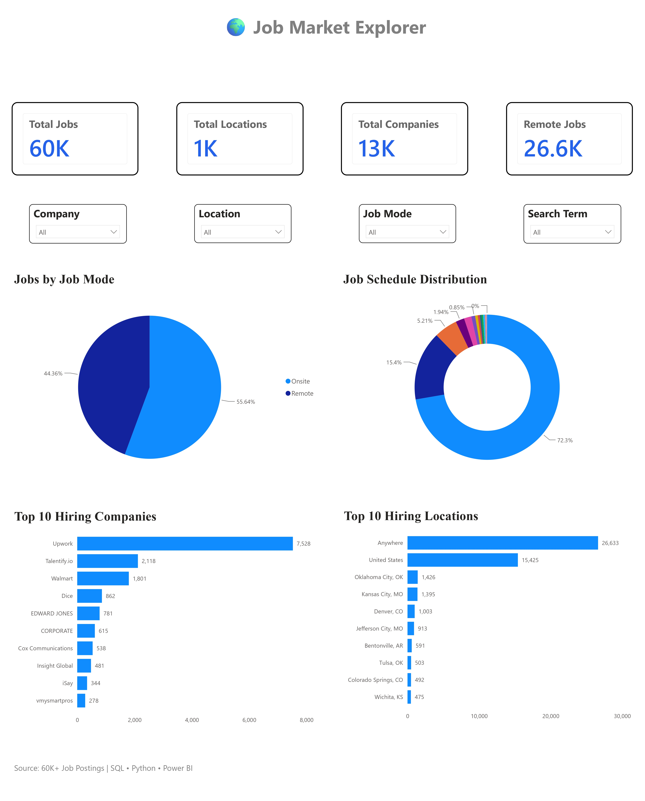

-------------------------------------------------------------------------------------------------
# 📊 Job Market Intelligence Dashboard

### End-to-End Data Analytics Project using SQL • Python • SQLite • Power BI
-------------------------------------------------------------------------------------------------


-------------------------------------------------------------------------------------------------
# 🚀 Project Overview

- The Job Market Intelligence Dashboard is a complete Business Intelligence project that analyzes 60,000+ job postings to uncover hiring trends, in-demand skills, salary insights, and job market patterns.

- The project demonstrates a complete Data Analytics workflow—from raw data processing using Python, database management with SQLite, analytical queries in SQL, and interactive dashboard development in Power BI.

- This dashboard helps recruiters, job seekers, students, and analysts understand the evolving job market through interactive visualizations and business insights.
-------------------------------------------------------------------------------------------------
# 🎯 Objectives
- Analyze over 60,000 job postings
- Discover the most in-demand technical skills
- Analyze salary trends across industries and locations
- Identify top hiring companies
- Explore remote vs onsite job opportunities
- Build an interactive executive dashboard for decision making
-------------------------------------------------------------------------------------------------
# 🛠 Tech Stack
| Technology   | Purpose               |
| ------------ | --------------------- |
| Python       | Data Cleaning & ETL   |
| Pandas       | Data Transformation   |
| SQLite       | Database Storage      |
| SQL          | Data Analysis         |
| Power BI     | Dashboard Development |
| DAX          | KPI Calculations      |
| Git & GitHub | Version Control       |
-------------------------------------------------------------------------------------------------
# 📂 Project Structure
```text
Job-Market-Intelligence-Dashboard/
│
├── Dashboard/
│   └── Job_Market_Intelligence_Dashboard.pbix
│
├── Dataset/
│   ├── jobs.csv
│   ├── jobs.db
│   └── processed_data.csv
│
├── Python/
│   ├── 01_clean_data.py
│   ├── 02_transform_data.py
│   ├── 03_load_sqlite.py
│   ├── 04_create_dimensions.py
│   ├── 05_build_star_schema.py
│   └── 06_export_tables.py
│
├── SQL/
│   ├── create_tables.sql
│   ├── insert_data.sql
│   ├── analysis_queries.sql
│   └── views.sql
│
├── Images/
│   ├── cover.png
│   ├── executive_dashboard.png
│   ├── skills_dashboard.png
│   ├── salary_dashboard.png
│   └── explorer_dashboard.png
│
├── README.md
├── requirements.txt
└── LICENSE
```
-------------------------------------------------------------------------------------------------
# 📈 Dataset Overview
| Feature            | Value   |
| ------------------ | ------- |
| Total Job Postings | 60,000+ |
| Companies          | 13,000+ |
| Locations          | 1,000+  |
| Skills             | 33+     |
| Database           | SQLite  |
| Dashboard Pages    | 4       |

---
# ⭐ Dashboard Pages

## 1️⃣ Executive Dashboard

Provides a high-level overview of the job market with key performance indicators and hiring trends.

### KPIs
- Total Jobs
- Total Companies
- Total Locations
- Total Skills
- Average Salary
- Highest Salary

### Visuals
- Top Hiring Companies
- Top Hiring Locations
- Job Mode Distribution
- Salary Category Distribution

### Key Insights
- Overall job market overview
- Hiring distribution by company
- Geographic hiring trends
- Job mode analysis
- Salary distribution overview

---

## 2️⃣ Skills Intelligence Dashboard

Analyzes the demand for technical skills across companies and job locations.

### KPIs
- Total Skills
- Jobs Requiring Skills
- Most Demanded Skill
- Average Skills per Job

### Visuals
- Top 15 Most Demanded Skills
- Remote vs Onsite Skill Demand
- Top Companies Hiring Skilled Roles
- Top Locations for Skilled Jobs

### Key Insights
- Most in-demand technical skills
- Skill demand across job modes
- Companies seeking skilled professionals
- Regional demand for technical skills

---

## 3️⃣ Salary Intelligence Dashboard

Provides comprehensive salary analysis across companies, locations, and job categories.

### KPIs
- Average Salary
- Median Salary
- Highest Salary
- Lowest Salary

### Visuals
- Average Salary by Job Mode
- Average Salary by Salary Category
- Top Highest Paying Companies
- Highest Paying Locations

### Key Insights
- Salary comparison across job modes
- Salary distribution by category
- Highest paying companies
- Geographic salary comparison

---

## 4️⃣ Job Market Explorer

Interactive dashboard for exploring job market trends using dynamic filters.

### KPIs
- Total Jobs
- Remote Jobs
- Total Companies
- Total Locations

### Visuals
- Remote vs Onsite Jobs
- Job Schedule Distribution
- Top Hiring Companies
- Top Hiring Locations

### Key Insights
- Interactive job market exploration
- Job schedule analysis
- Hiring company comparison
- Location-wise job availability
-------------------------------------------------------------------------------------------------
## 🔄 ETL Workflow

Raw Dataset

⬇️

Python Data Cleaning

⬇️

Feature Engineering

⬇️

SQLite Database

⬇️

SQL Analysis

⬇️

Power BI Data Model

⬇️

Interactive Dashboard
-------------------------------------------------------------------------------------------------
## 📌 Key Business Insights

### Hiring Trends

- Over **60,000** job postings analyzed
- More than **13,000** companies actively hiring
- Jobs available across **1,000+** locations

### Skills

- SQL is the most demanded skill
- Excel, Python and Power BI remain highly sought after
- Employers increasingly seek candidates with multiple technical skills

### Salary

- Significant salary variation exists across companies and locations
- High-paying opportunities are concentrated in select companies and regions

### Market

- Remote and onsite jobs are well represented
- Full-time positions dominate the market
- Search trends highlight sustained demand for data-related roles
-------------------------------------------------------------------------------------------------
## Dashboard Preview



### Executive Dashboard



### Skills Intelligence



### Salary Intelligence



### Job Market Explorer


-------------------------------------------------------------------------------------------------
## 📊 DAX Measures

```text
Total Jobs
Total Companies
Total Locations
Total Skills
Average Salary
Highest Salary
Median Salary
Lowest Salary
Jobs Requiring Skills
Most Demanded Skill
Average Skills per Job
Remote Jobs
```
-------------------------------------------------------------------------------------------------
# 💡 Business Value

This dashboard enables:

- Data-driven hiring analysis
- Skill demand identification
- Salary benchmarking
- Geographic hiring analysis
- Market trend exploration
- Interactive executive reporting
-----------------------------------------------------------------------------------------------
# 🚀 Future Improvements
- Live API integration for real-time job postings
- Automated ETL pipeline
- AI-powered skill recommendations
- Predictive salary forecasting
- Resume-to-job matching analysis
- Deployment to Power BI Service
-------------------------------------------------------------------------------------------------
# 📚 Skills Demonstrated
| Category      | Skills                 |
| ------------- | ---------------------- |
| Data Cleaning | Python, Pandas         |
| Database      | SQLite                 |
| Querying      | SQL                    |
| Modeling      | Star Schema            |
| BI            | Power BI               |
| Analytics     | DAX                    |
| Visualization | Interactive Dashboards |
-------------------------------------------------------------------------------------------------
👨‍💻 Author

Prasad Chaudhari

Aspiring Data Analyst | SQL | Python | Power BI | Excel

🔗 LinkedIn: [https://www.linkedin.com/in/prasad-chaudhari-145832287/]
💻 GitHub: [https://github.com/Prasad1103]

## ⭐ Support

If you found this project useful, please consider giving it a ⭐ on GitHub.

Your support helps showcase the project to the community and encourages further development.

---

Built with ❤️ using SQL • Python • SQLite • Power BI
